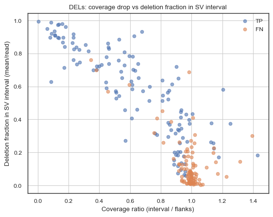

# 🧬 Mosaicome 

**Assembling the bigger picture of the genome, one piece at a time.**

[](https://github.com/collaborativebioinformatics/Mosaicome)
[](https://github.com/collaborativebioinformatics/Mosaicome)
[](https://opensource.org/licenses/MIT)

---

A central repository for **Team Mosaicome**'s project for the **Mosaic SV ROM Collaborative Bioinformatics SVM Hackathon**. Our goal is to develop an innovative machine learning pipeline for the accurate detection of genomic structural variations.

### **Table of Contents**
1. [The team](#-the-team)
2. [The Problem](#-the-problem)
3. [Tech Stack](#-tech-stack)
4. [Dataset](#-the-data)
5. [Project Roadmap](#-project-roadmap)
6. [Getting Started](#-getting-started)


---

### 👥 **The Team**

- [Luis Paulin](https://github.com/lfpaulin)
- [Daniel Baker](https://github.com/dnbaker)
- [Rafal Woycicki](https://github.com/rafalwoycicki)
- [Rajarshi Mondal](https://github.com/Rajarshi0)
- [Gerardo Fabián](https://github.com/Gedofs)
- [Asmaa Mahmoud](https://github.com/asmmahmoud)
- [Nadia Baig](https://github.com/nadiabaig)
- [Adrian Chalco](https://github.com/chalco777)
- [Gobikrishnan Subramaniam](https://github.com/gobikrishnan-s3141)
- [Ammara Saleem](https://github.com/ammarasaleem123)
- [Gavin Monahan](https://github.com/gavinmonahan)
- [Jacob Krol](https://github.com/jakekrol)
- [Xingtian Yang](https://github.com/yangyxt)
- [Neda Ghohabi Esfahani](https://github.com/nedaghohabi)
- [Qichen Fu](https://github.com/QichenFU)


---

### ❓ **The Problem**

Structural Variants (SVs) calling is a challenging process in which variants > 50bp are detected when compared to the reference genome. Many tools are available and already capable of detecting germline SVs. Low-frequency SVs (<20% VAF, aka mosaic) comprise a greater challenge as the signal is low. Our current strategy is able to detect ~50% of the SVs (VAF 5-100%) with 90% precision

ONT sequencing is still under development and new models for basecalling as well as new tools for aligning showed up since May this year. Better reads quality, meaning better nucleotides calling probabilities will allow better mapping, when using suited aligning tools.

Our goal is to improve recall without affecting much precision


---

### 🛠️ **Tech Stack**

This project will leverage a modern, open-source technology stack.

| Category          | Technology / Library                               | Purpose                               |
| ----------------- | -------------------------------------------------- | ------------------------------------- |
| **Language** | `Python 3.12+`                                      | Core programming language             |
| **Data Handling** | `Pandas`, `NumPy`                                  | Data manipulation & numerical analysis|
| **Alignment** | `Minimap2`, `Winnowmap`, `abpoa`                        | Data mapping & assembly             |
| **SV calling** | `Sniffles2`, `CuteSV`                              | Data manipulation & numerical analysis|
| **Visualization** | `Matplotlib`, `IGV`                            | Plotting results & data exploration   |
| **Development** | `Jupyter Lab`, `VS Code`                           | Interactive analysis & coding         |
| **Collaboration** | `Git`, `GitHub`                                    | Version control & project management  |

---

### 💾 **The data**

Long-read sequencing of six individuals from the HapMap project. The mix was done in-vitro so all sequencing randomness affect all samples the same
We have a high-quality benchmark dataset derived from assemblies


---

### 🗺️ **Project Roadmap**


Our progress will be tracked through the following key phases and milestones.

| Phase | Status | Key Milestones                                                                 |
| :---: | :----: | ------------------------------------------------------------------------------ |
| **1** |  `⏳`  | **Exploration & Strategy** <br> ⚫ Data Analysis <br> ⚫ Steps |
| **2** |  `⚪`  | **Development & Prototyping** <br> ⚫ Steps <br> ⚫ Steps |
| **3** |  `⚪`  | **Refinement & Validation** <br> ⚫ Steps <br> ⚫ Validation <br> ⚫ Final Documentation |

*Status Key: `⚪` Not Started, `⏳` In Progress, `✅` Completed*

#### **Exploration & Strategy**
Strategies:
 - Testing different parameters from each filter applied, some SVs were detected but filtered
 - As we are at the mercy of the aligners, we can improve alignment on candidate regions 
    - Re-alignment with newer options (eg minimap lr:hq, suited for reads with Phred Q > 20). Or one can optionally remap with Winnowmap as this tool depicted reduction in mapping error rate.
    - Traversal of full mm2 alignments via SA tag parsing. Group sequences by sets of aligned regions, as well as possibly merging across homologous regions using XA tags.
    - Align reads to the reference (mm2, winnowmap) several times with different parameters.
        - Take reference windows and cluster reads by aligned regions.
        - Take abnormal events (e.g., aligning two similar regions on 2 different chromosomes or different strands on the same chromosome) and then feed into sequence clustering/consensus to get candidate haplotypes.
        - Align the local reads against generated haplotypes to filter for misassemblies/low quality results.
 - Assembly of candidate regions abpoa, which can potentially provide local haplotypes. It can automatically group and generate consensus, and it's pretty fast. 
 - Define attributes of FNs to examine, then contrast attribute distribution to TPs
    - Attributes
        - number of supporting reads
        - Mapping quality
        - Avg. # of supplementary alignments for supporting reads
     
 - Impact of Read Quality on SV Calling
   On the way to finding a better strategy for recalling structural variants (SVs),  
we observed that the quality of ONT reads plays a crucial role.  


#### **Region analysis of FN vs TP**

#### QC — MAPQ Distribution
TP reads cluster tightly near **MAPQ≈60**, while FN shows a bimodal mix with a **large peak near 0** and a smaller one near 60. Means diverge (**FN≈39** vs **TP≈57**; medians ≈60 for both) with **p ≪ 1e-10** for Mann–Whitney and Welch’s t-test. We see many FNs come from **low/ambiguous mappings**. MAPQ-based filtering or re-alignment could recover signal. And that's what we tried below!!


#### DELs — Coverage in interval vs flanks

**Histogram (left):** In TP the coverage ratio of interval/flanks of the BP shows a **strong tail at ratios <0.8** (true coverage drop inside the interval). FN **clusters near 1.0–1.1**, i.e., little to no drop.
**Boxplot (right):** Medians **TP≈0.63** vs **FN≈0.99** (Δ≈0.36), **p ≪ 1e-10**. We note that TP exhibits a clear **coverage drop**; FN remains \~flanks ⇒ weak/absent signal.

<p float="left">
  
  
</p>


#### DELs — Coverage vs deletion signal **inside** the interval

There’s a clear **negative relationship**: when coverage ratio drops (<0.8), the **per-read deletion fraction** inside the interval rises (up to \~1). **TP** dominate this region; **FN** cluster near **ratio≈1** with low fractions (<0.1). Also, deletion enrichment is **high for TP** when coverage drops (ratio <0.8), reaching values well >1; **FN** stay near **0–5** and stay around ratio \~1. **Takeaway:** enrichment is a robust signal for **excess Deletion events** in the interval vs flanks.

<p float="left">
  
  
</p>

#### **INS — Insertion prevalence in windows (outside BP)**

We examined the fraction of reads around the breakpoint with at least one insertion.
**Plots:** Left = histogram. Right = KDE density (area≈1 per group). We note a pattern of **TP** shift to **high prevalence (≈0.7–1.0)**, while **FN** cluster **lower (≈0–0.4)**. Mann–Whitney U **p = 0.003** indicates a significant difference between TP and FN; with a higher median in TP (+0.156), insertion prevalence near the breakpoint is a useful discriminator of true INS in this dataset.


<p float="left">
  
  
</p>


#### **Development**
Below is a comparison of SV calling results between using **all mapped reads (QV > 10)** and restricting the analysis to **reads with Phred quality > 20**.

#### SV Calling Performance Comparison (alignment options)

| Dataset / Mapping Strategy       | Alignments (Primary / Secondary / Supplementary) | SVs Found | FP | FN  | Precision | Recall | F1    |
|----------------------------------|--------------------------------------------------|-----------|----|-----|-----------|--------|-------|
| All 369,812 reads, minimap2 **map-ont** | 369,812 / 319,549 / 51,286                      | **36,741**    | 30 | 297 | 90.96%    | **50.42%** | 64.88 |
| All 369,812 reads, minimap2 **lr:hq**   | 369,812 / 285,330 / 46,993                      | 10,555    | 34 | 314 | 89.34%    | 47.58% | 62.09 |
| QV > 20 (160,134 reads), minimap2 **lr:hq** | 160,134 / 117,005 / 21,019                      | **5,253**     | 23 | 326 | 92.23%    | **45.58%** | 61.01 |

##### Interpretation

From this comparison, we see that using all reads with minimal quality filtering (QV > 10) leads to a large excess of predicted SVs (36,741), almost **7× more than when using only QV > 20 reads (5,253 SVs)**.  
However, this higher callset does **not substantially improve recall**: the recall rate is only **50%** with all reads versus **45%** with QV > 20 reads.  

Thus, although low-quality reads inflate the number of SV calls, they do not yield proportionally better sensitivity, and may instead increase false positives.

#### SV Calling Performance Comparison (different aligners)
Evaluate two aligners (minimap2, winnowmap) × three MAPQ filters (0/20/40) × five Sniffles2 profiles (very_sens, sensitive, balanced, strict, very_strict), then benchmark each callset with Truvari and optionally merge callsets with SURVIVOR (union, intersection). 
To explore precision/recall extremes via union ( recall) and intersection ( precision).

#### Filtering options
We tested multiple filters from Sniffles2
|#test | FP  | FN | Precision | Recall | F1 | Notes |
|------|-----|----|-----------|--------|----|--------|
| Best diff (7-1) | 40 | -75 | -6.62% | 12.52% | 7.21% |  |
| 1 | 30 | 297 | 90.96% | 50.42% | 64.88% | Default |
| 2 | 46 | 259 | 88.08% | 56.76% | 69.04% | --mosaic-af-min 0.01 (USER) |
| 3 | 70 | 224 | 84.27% | 62.60% | 71.84% | --mosaic-af-min 0.01 --minsupport 3 (USER) + mosaic_min_reads = 2 for DEL and INS (INTERNAL) |
| 4 | 70 | 223 | 84.30% | 62.77% | 71.96% | --mosaic-af-min 0.01 --minsupport 3 (USER) + mosaic_min_reads = 2 for DEL and INS (INTERNAL) + minsvlen FILTER deactivated if SUPPORT >= 10 (INTERNAL) |
| 5 | 34 | 314 | 89.34% | 47.58% | 62.09% | Default + minimap2 lr:hq (instead of map-ont) with all reads from original BAM file |
| 6 | 23 | 326 | 92.23% | 45.58% | 61.01% | Default + minimap2 lr:hq (instead of map-ont) with all reads from original BAM file, BUT only with reads with Q>20, 160134 reads less than half of tatal reads |
| 7 | 70 | 222 | 84.34% | 62.94% | 72.08% | --mosaic-af-min 0.01 --minsupport 3 --mapq 18 (USER) + mosaic_min_reads = 2 for DEL and INS (INTERNAL) + minsvlen FILTER deactivated if SUPPORT >= 10 (INTERNAL) |
| 8 | 34 | 320 | 89.13% | 46.78% | 61.18% | Default + winnowmap |
| 19 | 41 | 281 | 88.58% | 53.09% | 66.39% | minimap2 lr:hq with >Q20 reads and Sniffle2Mod --mosaic-af-min 0.01 --minsupport 3 --mapq 18 (USER) + mosaic_min_reads = 2 for DEL and INS (INTERNAL) if (precise sd_len and sd_pos is low) + minsvlen FILTER deactivated if SUPPORT >= 10 (INTERNAL) | 


#### Other SV calling tools
We tested other tools (CuteSV) to compare the results from the benchmark

|Tool | version | FP | FN | Precision | Recall | F1 | Notes |
|-----|---------|----|----|-----------|--------|----|-------|
|cuteSV | v2.1.2 |  84  |  267 |  80% |  55% | 65% |All SVs are included| 
|cuteSV | v2.1.2  |   26  |  382  | 89% |  36% |  52% |Only PASS SVs are included | 
|SURVIVOR merge | v1.0.7 | 55 | 278 | 85% | 53% | 66% | Sniffles default with cute SV (All)| 

#### BAM-derived feature extraction (no re-calling Sniffles)
To study why certain truth SVs were missed (FN) and how detected SVs (TP) differ, we extract quantitative evidence directly from the BAM around each breakpoint—without re-calling Sniffles.
Rather than re-calling Sniffles at candidate sites, we built a BAM-only feature extractor around breakpoints (and with adaptive windows) that outputs per-SV aggregates and optional per-read details: depth at edges and inside, read composition, robust MAPQ stats, an identity proxy from `NM`, soft-clip burden and breakpoint-specific soft-clip fractions, split-read prevalence (`SA:Z`), indel load per kb, and strand balance. These tables are now the substrate for PCA/ML and principled tuning of mapping/calling parameters, with a quick interpretation rubric for DEL/INS and for understanding typical FN signatures.

#### Re-alignment to T2T to study FN
Re-alignment to T2T. Then we examined a couple of regions that were classified as false negatives (deletion) from Sniffles/hg38. 
See the bottom figure, only one read has this deletion.
Top figure: hg38 region and Middle figure: T2t region


#### **Validation**
🚧

---

### 🚀 **Getting Started**

*(This section will be updated with instructions on how to set up the environment and run the project.)*

1.  **Clone the repository:**
    ```bash
    git clone https://github.com/collaborativebioinformatics/Mosaicome.git

    ```
2.  **Set up the environment:**
    ```bash
    # Command to be added
    ```
3.  **Run the pipeline:**
    ```bash
    # Command to be added
    ```

